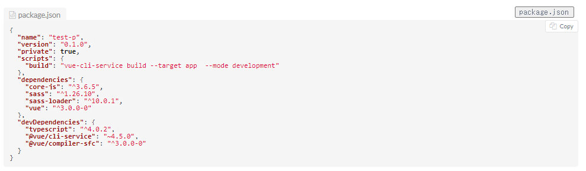
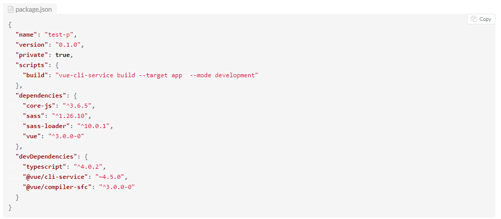

# 概要
esa.io のソースコードのシンタックスハイライトをカスタムするuser.jsファイル

after

before

- 行間を狭く
- ファイル名、フォルダ名をボタンクリックでコピー

# 動作確認環境

- google chrome
- windows 10
- Tampermonkey

# 使い方

- ビルドをしてout/script.user.jsを作成
- ファイルをTampermonkeyにコピペ

# ビルド方法

- `npm ci`
- `npm run build`

# Licence
MIT License